# 👶 Dr. Baby — Vaccination Application

> A comprehensive mobile application designed to simplify and streamline baby vaccination management for parents and caregivers.


---

## 📋 About The Project

**Dr. Baby** is a cross-platform mobile application (iOS & Android) built to help parents track and manage their newborn's vaccination schedule. The app ensures no mandatory vaccination is missed by providing automated reminders, calendar scheduling, hospital booking, and an AI-powered chatbot for health queries.

This was developed as a **Final Year BCA Project** at Christ College (Autonomous), Irinjalakuda, University of Calicut (2021–2024).

### 👥 Team Members
| Name | Registration No. |
|------|-----------------|
| Nandana Jinesh | CCAVBCA023 |
| Naveed Nihan K M | CCAVBCA045 |
| Roxon Paul Varghese | CCAVBCA046 |
| Milan Mathachan | CCAVBCA007 |

**Project Guide:** Mr. Thoufeeq Ansari, Assistant Professor, Department of Computer Science

---

## ✨ Features

- 🔐 **User Authentication** — Secure registration and login with token-based auth
- 👶 **Baby Profile Management** — Create and manage profiles for your baby (name, DOB, gender)
- 📅 **Vaccination Calendar** — Auto-generated vaccination schedule based on baby's date of birth
- 🏥 **Hospital Listing** — Browse hospitals with available vaccine slots
- 📋 **Vaccine Booking** — Book vaccination appointments at preferred hospitals
- ✅ **Vaccine Confirmation** — Track which vaccines have been completed
- 🤖 **AI Chatbot** — Get answers to vaccination-related queries (powered by OpenAI + LangChain)
- 📧 **Email Reminders** — Automated email notifications for upcoming vaccinations (via Celery)

---

## 📱 Screenshots

<p align="center">
  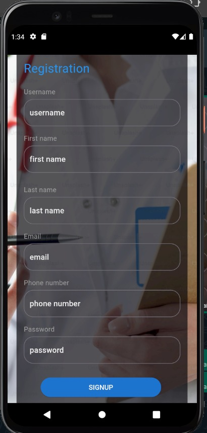
  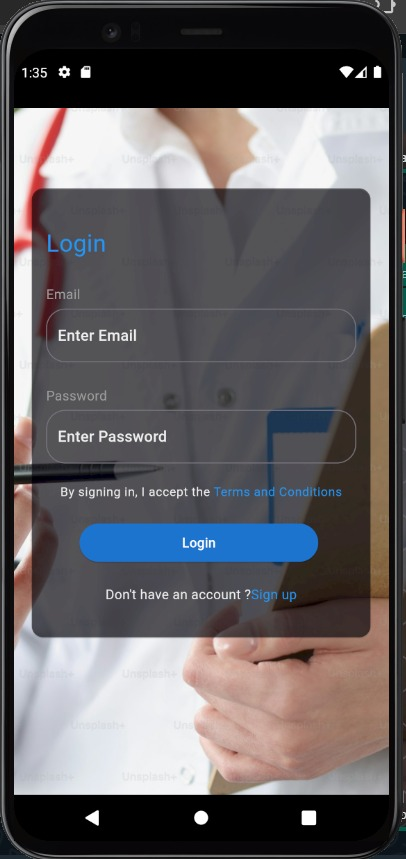
  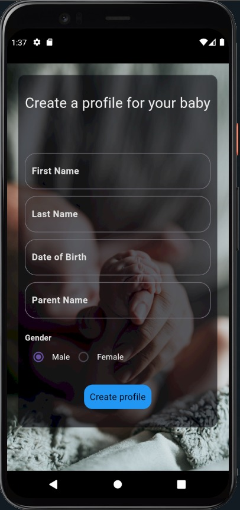
  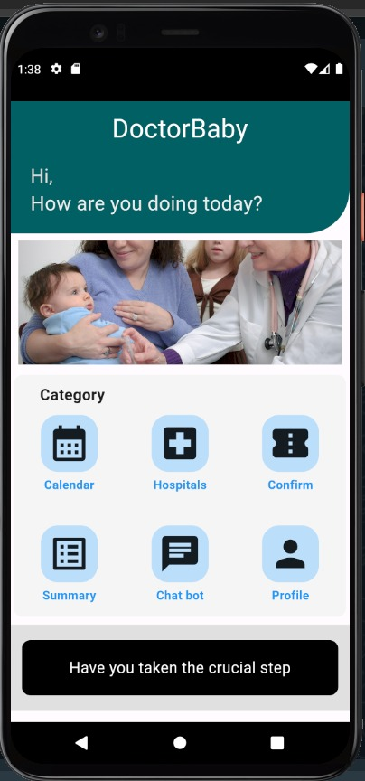
</p>

<p align="center">
  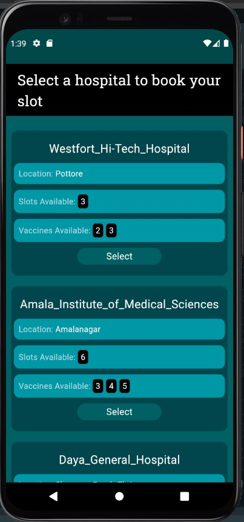
  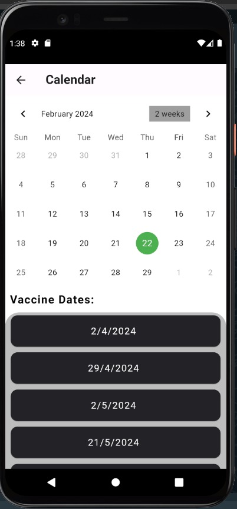
  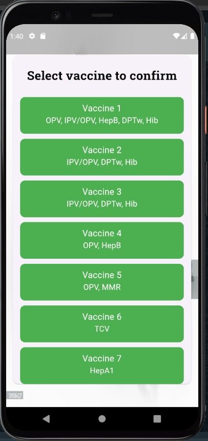
  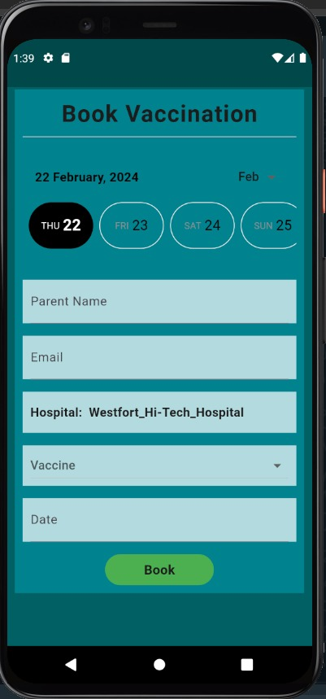
</p>

<p align="center">
  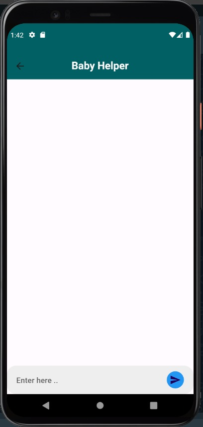
  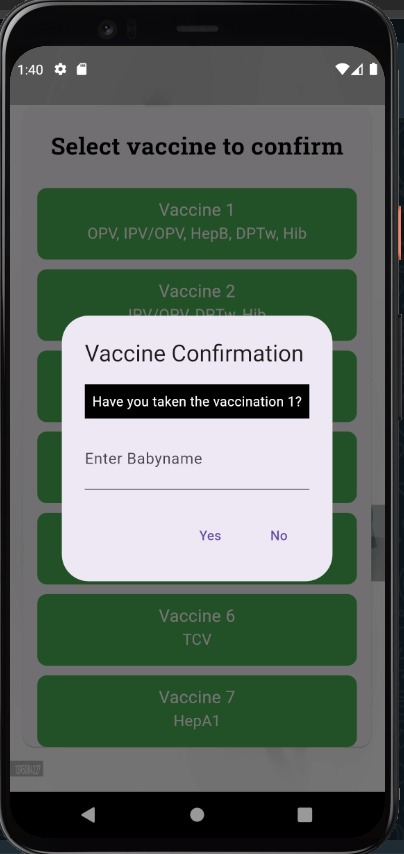
  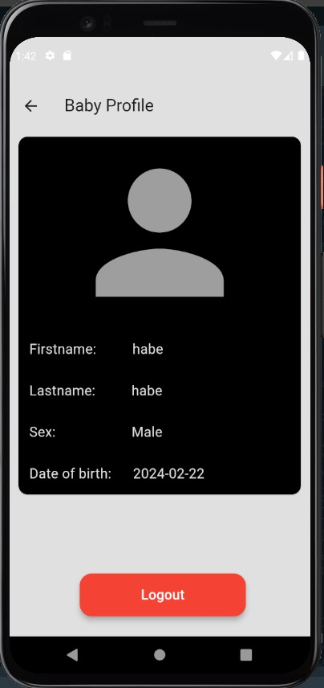
</p>

---

## 🛠️ Tech Stack

| Layer | Technology |
|-------|-----------|
| **Frontend** | Flutter (Dart) |
| **Backend** | Python Django REST Framework |
| **Database** | SQLite3 |
| **Task Queue** | Celery + Django Celery Beat |
| **AI/Chatbot** | OpenAI API, LangChain, FAISS |
| **IDE** | Visual Studio Code |

---

## 🗃️ Database Schema

### User Account Table
| Field | Type | Constraint | Description |
|-------|------|-----------|-------------|
| UserID | int(11) | Primary Key | Unique user ID |
| username | varchar(50) | Not Null | Username |
| password | varchar(250) | Not Null | Hashed password |
| email | varchar(100) | Not Null | Email address |
| FirstName | varchar(200) | Not Null | First name |
| LastName | varchar(20) | Not Null | Last name |
| Phone | varchar(50) | Not Null | Contact number |
| Role | varchar(250) | Not Null | Relation to baby |

### Baby Profile Table
| Field | Type | Constraint | Description |
|-------|------|-----------|-------------|
| BabyID | int(11) | Primary Key | Unique baby ID |
| UserID | int(9) | Foreign Key | Reference to User |
| FirstName | varchar(200) | Not Null | Baby's first name |
| LastName | varchar(20) | Not Null | Baby's last name |
| DateOfBirth | date | Not Null | Baby's DOB |
| Gender | char(1) | Not Null | M/F |
| Location | varchar(5) | Not Null | Location |

### Hospital Table
| Field | Type | Constraint | Description |
|-------|------|-----------|-------------|
| HospitalID | int(11) | Primary Key | Hospital ID |
| Hospital | varchar(50) | Not Null | Hospital name |
| SlotsAvailable | varchar(50) | Not Null | Vaccine slots |
| VaccineAvailable | varchar(50) | Foreign Key | Available vaccines |

### Vaccine Booking Table
| Field | Type | Constraint | Description |
|-------|------|-----------|-------------|
| BookingID | int(11) | Primary Key | Booking ID |
| ParentName | varchar(50) | Foreign Key | Parent reference |
| ParentEmail | varchar(50) | Not Null | Contact email |
| Hospital | varchar(50) | Foreign Key | Hospital reference |
| VaccineAvailable | varchar(50) | Foreign Key | Vaccine reference |
| BookingDate | date | Not Null | Appointment date |

---

## 📁 Project Structure

```
dr-baby/
├── README.md
├── screenshots/                  # App screenshots
│   ├── 01-signup.jpg
│   ├── 02-login.jpg
│   ├── ...
├── docs/
│   └── Dr_Baby_FinalYr_project.pdf   # Full project report
├── code/
│   ├── backend/                  # Django REST API
│   │   ├── manage.py
│   │   ├── requirements.txt
│   │   ├── babyvaccinepro/       # Django project settings
│   │   │   ├── settings.py
│   │   │   ├── urls.py
│   │   │   └── wsgi.py
│   │   └── vaccine/              # Main app
│   │       ├── models.py
│   │       ├── views.py
│   │       ├── serializer.py
│   │       ├── urls.py
│   │       ├── tasks.py
│   │       └── admin.py
│   └── frontend/                 # Flutter mobile app
│       ├── pubspec.yaml
│       └── lib/
│           ├── main.dart
│           └── screens/
│               ├── login_screen.dart
│               ├── signup_screen.dart
│               ├── home_screen.dart
│               └── ...
```

---

## 🔧 Setup Instructions

### Backend (Django)
```bash
# 1. Navigate to backend folder
cd code/backend

# 2. Create virtual environment
python -m venv venv
source venv/bin/activate   # On Windows: venv\Scripts\activate

# 3. Install dependencies
pip install -r requirements.txt

# 4. Run migrations
python manage.py makemigrations
python manage.py migrate

# 5. Create admin user
python manage.py createsuperuser

# 6. Start server
python manage.py runserver
```

### Frontend (Flutter)
```bash
# 1. Navigate to frontend folder
cd code/frontend

# 2. Get dependencies
flutter pub get

# 3. Run app
flutter run
```

---

## 🧪 Modules

### Admin Module
- Manage hospital listings and booking slots
- Add/remove vaccine programs
- View and manage user database
- Monitor vaccination records

### Parent Module
- Register and create baby profile
- View personalized vaccination calendar (auto-calculated from baby's DOB)
- Book vaccination appointments at nearby hospitals
- Confirm completed vaccinations
- Chat with AI assistant for vaccination queries

---

## 📌 Vaccination Schedule

The app automatically calculates vaccination dates based on the baby's date of birth:

| Vaccine Group | Vaccines | Days After Birth |
|--------------|----------|-----------------|
| Vaccine 1 | OPV, IPV/OPV, HepB, DPTw, Hib | 40 days |
| Vaccine 2 | IPV/OPV, DPTw, Hib | 67 days |
| Vaccine 3 | IPV/OPV, DPTw, Hib | 70 days |
| Vaccine 4 | OPV, HepB | 89 days |
| Vaccine 5 | OPV, MMR | 180 days |
| Vaccine 6 | TCV | 304 days |
| Vaccine 7 | HepA1 | 363 days |

---

## 🔮 Future Scope

- Integration with government vaccination databases
- Multi-language support
- Growth tracking and milestone monitoring
- Telemedicine consultation feature
- Push notifications for vaccine reminders
- Offline mode support

---

## 📄 License

This project was developed for academic purposes as part of the BCA program at Christ College (Autonomous), Irinjalakuda, affiliated to the University of Calicut.

---

## 🙏 Acknowledgements

- Mr. Thoufeeq Ansari — Project Guide
- Ms. Sini Thomas — Head of Department, Computer Science
- Ms. Sowmya P.S — Class Teacher
- Christ College (Autonomous), Irinjalakuda
